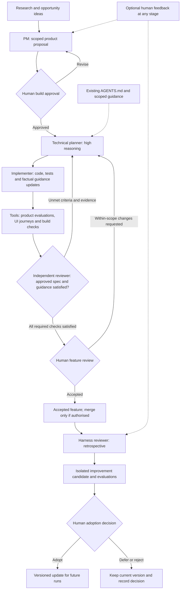

# Modular multi-agent product development workflow — Meal Map pilot

Status: Draft for review — not approved for implementation

Version: 0.6

Date: 8 September 2026

Product owner and final decision-maker: Arpit

## 1. Purpose and agreed direction

Design a reusable development workflow that discovers worthwhile product opportunities, turns them into scoped proposals, implements approved features, verifies real user journeys, and preserves the context behind its work. Improve the workflow through evaluation results and optional human feedback. Distribute it as a standalone package with a terminal user interface (TUI) for installation and project setup, with Meal Map as its first project profile and pilot.

This document is the planning deliverable. Approval to build the workflow, connect external records, or start a feature would be a subsequent explicit instruction.

The proposal incorporates these requirements from our discussion:

- Research and idea development precede the Product Manager when discovery is needed.
- Evaluations emphasise product usefulness and user outcomes. Android implementation and Android evaluations remain outside this pilot.
- Tools run repeatable evaluations and journey-specific UI tests; Meal Map uses iOS tests through a platform adapter.
- Notion is the proposed human review and approval adapter for Meal Map, rather than a dependency of the shared workflow rules.
- Human feedback is welcome at every stage but is optional and distinct from approval.
- Prompts, context, decisions, build evidence, and feedback remain traceable to the versions used at the time.
- Harness and skill improvements are evaluated before human-approved adoption. Here, “harness” means the runner, agent instructions, tools, handoffs, and checks around the development work.
- New projects reuse the workflow through a project profile and compatible adapters, without copying or editing the core. Product data, approval decisions, feedback and run histories stay scoped to their project.
- Install the reusable tool once per machine, then use its TUI to initialise or reconfigure each selected project. The installer is part of the pilot, not an app-specific script or a required web dashboard.
- Use the repository's existing `AGENTS.md` guidance and keep its durable facts aligned with approved changes, without replacing it with a competing instruction file.
- Development uses three subagents: a high-reasoning technical planner, an implementer and an independent reviewer. Unmet specification requirements return to the planner for another iteration.
- An interactive workflow graph, human-authored flows and general stage-specific model controls are future scope. The setup TUI and high-reasoning planner are part of the pilot. The diagram below explains the proposal; it is not an implemented editor or live execution view.

## 2. Modular architecture and project onboarding

Separate reusable workflow behaviour, project knowledge and tool integrations. Meal Map-specific examples in the remaining sections describe the first profile, not mandatory behaviour for every future project.

| Module | What it owns | What changes for another project? |
| --- | --- | --- |
| TUI installer and setup | Guided project selection, profile creation, capability checks, change previews and installation lifecycle | Run the same setup against a different project; use shared validation rather than duplicate workflow rules |
| Workflow core | Stage transitions, role contracts, approval checks, handoffs, run state and recovery, record schemas | Reuse a pinned release without application-specific edits |
| Project profile | Product goals, research scope, repository context, architecture rules, human reviewers, allowed actions, budgets, acceptance criteria and journeys | Supply the new project's configuration and domain knowledge |
| Role prompts and skills | Reusable discovery, PM, engineering, review and learning instructions | Apply versioned project extensions where needed; preserve shared contracts |
| Agent runtime adapter | Dispatch, progress, cancellation and result collection | Map the same role requests onto the available execution environment |
| Human review adapter | Review packets, feedback and attributable decisions | Map to the selected review surface; Notion is the pilot choice |
| Evaluation and test adapters | Product evaluations, builds, unit checks, platform journeys and evidence collection | Select compatible runners and map project-specific checks |
| Repository and artifact adapters | Workspace preparation, source revisions, run manifests and evidence references | Configure the repository, permitted paths and artifact destination |

Start with one versioned workflow package in its own future repository, containing the TUI, core contracts, role templates and supported adapters. Install the launcher and versioned releases outside application repositories. Each adopting project keeps a small configuration directory, proposed as `.product-workflow/`, containing its profile, version lock, context index, product scenarios and any role extensions. It references the shared package rather than copying its core into the app. This plan does not create either package or configuration directory. Separate services or a marketplace are unnecessary for the pilot.

The profile declares a stable project ID, product brief, repository and architecture references, reviewers, approval source, enabled workflow stages, adapter selections, command mappings, data fixtures, budgets and artifact location. Checks have stable IDs and explicit required or optional status. Credentials are referenced through the configured environment rather than stored in the profile.

Optional stages such as discovery can be omitted when the request already provides enough product direction. Features that change a user journey still need the agreed journey verification; a profile must not silently remove a required check or use an extension to bypass approval rules. Projects without a UI can declare a different evidence contract at onboarding.

Adapters expose narrow operations such as submit a review packet, fetch decisions, execute a named check, retrieve evidence or resume a run. The shared contract records project/run IDs, artifact revision, execution state, outcome, evidence references and errors. Distinguish pending, completed, unavailable and failed execution from a check's passed, failed, blocked or not-run result. Include retry identifiers and approval provenance so adapter retries cannot duplicate a request or apply a decision to the wrong project.

Before execution, validate the profile, permissions, adapter compatibility and available capabilities. An unavailable required capability blocks its dependent stage with a specific reason. An unavailable optional capability is recorded as missing coverage. “Plug and play” means configuration plus verified integrations, not an assumption that every host has the same tools.

### TUI installation and project setup

The initial interface is a keyboard-driven setup wizard, not a live workflow editor. Its responsibility is to make the same workflow usable in a selected repository. The implementation language, terminal framework, package name and distribution channel remain open choices; no working installation command is claimed yet.

Proposed onboarding sequence:

1. **Install once:** obtain a trusted, versioned release of the standalone tool. Keep installation local to the user by default; do not silently change global agent settings or install unrelated dependencies.
2. **Choose the project:** select and confirm the exact repository root. Detect existing setup, instruction files and likely build/test tooling through read-only inspection. Show detected values as suggestions, not authoritative assumptions.
3. **Choose a profile:** start from a supported template or a generic profile; supply product context, architecture references, reviewers and acceptance journeys. Reusing a template must not copy another project's private context, credentials, approvals or history.
4. **Configure integrations:** choose the supported runtime, evaluation/test and review adapters. Validate the required high-reasoning planner capability. Meal Map defaults to the proposed Notion review adapter; another project supplies its own supported mapping. Store credential references, not secret values, in versioned files.
5. **Review proposed changes:** display the exact files to create or modify, selected release, enabled capabilities, required permissions and missing tools. Preserve existing `AGENTS.md`; any necessary setup addition appears as a narrow optional patch, never a replacement. A project without guidance gets a draft to review rather than invented facts.
6. **Confirm and apply setup:** write only the confirmed project configuration and approved patches. Re-running setup must detect existing records, avoid duplicates and show conflicts for user resolution. Interrupted setup must be recoverable without leaving a half-valid installation; rollback must preserve unrelated or subsequently edited files.
7. **Check readiness:** validate configuration and non-mutating tool availability, then preview a sample review packet. Repository scripts, builds, paid evaluations, external record creation and dependency downloads require their relevant explicit setup/run authority; merely detecting a command does not authorise executing it. Report Ready for a feature proposal, Setup incomplete or a specific blocked capability.

Confirmation to install or configure is not feature build approval, harness promotion, merge permission or release permission. Setup ends without dispatching the development loop. Starting the first feature is a separate explicit action under the ordinary approval process.

The TUI is a thin interface over shared setup and validation operations. It does not contain a second coordinator or independent approval logic. The runner consumes the same saved profile and version lock, so another interface can be added later without changing execution semantics.

### Installation ownership and lifecycle

| Scope | Stored content | Boundary |
| --- | --- | --- |
| Machine installation | Launcher and versioned shared releases | No shared product context or cross-project approval state; updating the launcher does not silently change a project's pinned runtime |
| Project setup | Profile, version lock, context references, project scenarios and installation ownership record | Version suitable configuration with the project; use repository-relative references where possible and separate machine-local paths |
| Project run storage | Iterations, manifests, evidence and review references | Keep project/run isolation and the existing artifact-retention rules; never treat private run history as a reusable template |

The ownership record identifies installer-created files and exact patches, with revisions or checksums. Existing project files remain user-owned. Reconfigure through a previewed diff; do not overwrite manual changes to generated configuration either. Missing credentials or host-specific paths after moving a project trigger a setup check, not guessed replacements.

Updates are explicit per-project actions: show release and schema changes, check adapter compatibility, preview migrations, retain the previous working configuration and pinned release, then require confirmation before adoption. Installed releases may coexist so another project or active run is not forced to upgrade. Updating shared workflow behaviour still requires the harness-adoption decision; one attributable confirmation can cover both adoption and the exact migration rather than requiring duplicate approvals.

Provide a detach/remove-setup path that previews its exact targets and preserves app code, existing `AGENTS.md`, credentials and run evidence by default. Remove only confirmed installer-owned content; modified files or shared releases still used by another project require separate handling. Keep recovery information for any approved removal. This defines future behaviour; nothing is installed, upgraded or removed by this plan.

Pin the core, profile, adapter, prompt, skill and rubric versions for each run. Resuming uses the recorded configuration; upgrades affect new runs unless an active run is explicitly migrated and its approval/evidence compatibility checked. Each project's adoption of a shared improvement is opt-in, with the prior version retained for rollback.

Namespace records and artifacts by project and run, and restrict context retrieval to the active project. A reusable lesson is promoted separately from the private source feedback, after review and removal of project-specific data. Shared runtime resources, such as an iOS simulator, need explicit ownership or queued access even when project workspaces are separate.

### Existing AGENTS.md and drift prevention

Use the existing root `AGENTS.md` and applicable scoped instruction files as project guidance. Do not generate a parallel `agent.md` or copy the same rules into every role prompt. The project profile links to the guidance; the reusable core defines how it is resolved, supplied and checked.

Codex builds its instruction chain at run startup, with directory-specific precedence; editing a file does not imply that an already-running agent has refreshed its instructions. The runtime adapter must respect the supported discovery rules and explicitly refresh context at a handoff or start a fresh agent when needed. See OpenAI's [AGENTS.md guidance](https://learn.chatgpt.com/docs/agent-configuration/agents-md).

1. **Load and record:** resolve the instruction files relevant to each agent's working directory and target paths, including applicable overrides. Record loaded paths and revisions, and verify required guidance has not been missed or truncated. Keep the pre-run policy baseline available to the reviewer.
2. **Identify impact:** the technical planner flags which approved changes affect durable guidance: architecture boundaries, module paths, setup, build/test commands, configuration or established conventions.
3. **Update alongside code:** the implementer prepares a narrow factual guidance patch in the same feature change. Document observed repository behaviour, not an unimplemented intention. Preserve unrelated guidance and link detailed rationale or logs instead of turning `AGENTS.md` into a run diary.
4. **Review for drift:** the independent reviewer checks the guidance against the actual changed files and verification evidence. A no-change result is valid when no durable guidance changed. Contradictions or unsupported claims return to the planner with the other findings.
5. **Carry forward:** accepted code and guidance travel together. Record the before/after revisions and provide reviewed factual updates explicitly to the next handoff. Pending guidance edits remain reviewable proposals, not new authority over the reviewer.

Routine factual maintenance is covered by the feature's existing approval. Changes to permissions, mandatory checks, approval rules or shared harness behaviour need the applicable human decision; agents cannot authorise their own work by editing instructions. Global personal guidance is outside this repository-maintenance scope. An unrelated pre-existing inconsistency is logged for separate triage unless correcting it is necessary for the approved work.

Core and role versions remain pinned while code and factual guidance evolve as versioned feature artifacts. This is not permission for silent mid-run policy or prompt upgrades. No actual `AGENTS.md` is changed by this planning document.

## 3. Proposed operating model

The main sequence is research, opportunity development, PM proposal, build approval, implementation, verification, and human review. A separate learning cycle examines completed runs and proposes harness improvements.

| Stage | Primary output | Who decides the next step? |
| --- | --- | --- |
| Research | Findings, sources, uncertainties, and contradictory evidence | Discovery agent within the agreed research question |
| Opportunity development | Up to three evidenced opportunities | PM selects, defers, rejects, or requests more evidence |
| Product planning | Feature brief, intended journey, acceptance scenarios, feasibility and risks | Arpit approves scope for building |
| Technical planning | Acceptance-to-task mapping, technical decisions, test plan and guidance impact | High-reasoning planner hands a scoped plan to the implementer |
| Implementation | Code, tests, factual guidance updates and execution evidence | Implementer hands the exact candidate revision to review |
| Verification and independent review | Criterion-by-criterion verdict, product/journey evidence and guidance consistency | Reviewer returns deficiencies to the planner or prepares human review |
| Human review | Acceptance decision and, optionally, explicit merge permission | Arpit |
| Harness learning | Proposed prompt, skill, tooling, or workflow improvement with comparison evidence | Arpit approves adoption |

A concrete feature request can enter directly at product planning. Research is used to resolve a meaningful uncertainty, rather than being compulsory for every small change.

### Visual overview of the proposed workflow

The coordinator manages handoffs, state and evidence across the map. Gates labelled “Human” require a human decision; the independent reviewer does not replace them. Optional feedback can also be attached directly to any artifact or stage; its two drawn links show planning and learning uses without duplicating every connection. Missing approvals remain pending. Material scope changes return to the product proposal and build approval, even when identified during final review. Any stage can pause as blocked under section 4's rules; a blocked run can also inform a retrospective before feature acceptance.

## 4. Agent responsibilities

Use logical roles rather than requiring a separate always-running agent for each role. The development loop specifically uses three distinct subagent contexts for planning, implementation and independent review; it is not one agent self-certifying its work.

| Role | Responsibility | Boundary |
| --- | --- | --- |
| Coordinator | Maintains state, prepares context, dispatches bounded work, records handoffs and assembles review packets | Cannot grant human approval or redefine acceptance criteria to pass a run |
| Discovery agent | Researches the problem and develops possible opportunities in two distinct passes | Findings and ideas are proposals; they do not authorise development |
| Product Manager | Owns prioritisation, user value, scope, intended journeys and acceptance criteria | Distinguishes evidence from hypotheses and does not invent usage data |
| Technical planner | Provides feasibility input, then uses high reasoning to turn the approved spec and review findings into a scoped implementation plan | Does not change product scope or acceptance criteria; identifies guidance and verification impact |
| Implementer | Executes the plan, changes code/tests, maintains factual repository guidance and gathers evidence | Sole development-loop writer; cannot approve its own result or silently expand scope |
| Independent reviewer | Checks every mandatory criterion, the exact diff, product/UI evidence and guidance consistency | Uses the approved spec and pre-run rules; returns findings to the planner, not a self-authorised fix |
| Harness reviewer | Classifies recurring problems and tests improvement candidates | Cannot promote its own changes or weaken required checks |

For the pilot, run one active feature at a time. Parallel work is useful for independent research, feasibility checks, and review. Give writers explicit ownership of files or isolated workspaces; the coordinator owns integration and shared status updates.

The Meal Map profile should reference the existing [Meal Map architecture](ARCHITECTURE.md): App composition, feature presentation, Domain contracts and Data implementations. Other profiles supply their own architecture rules. Before a worktree is created, agree the source revision and how any relevant uncommitted work is included. A clean checkout from an older commit is not automatically the right baseline.

### Planner → implementer → reviewer loop

The PM owns **what and why** before approval; the technical planner owns **how** after approval. The planner must use a high-reasoning-capable model with a supported high reasoning setting. Select the actual available model during setup and record the effective model and setting; do not silently downgrade if that requirement cannot be met. The other two roles can use the configured runtime defaults for the pilot.

| Handoff | Required packet |
| --- | --- |
| Coordinator → planner | Immutable approved spec and criterion IDs, effective repository guidance, workspace baseline, allowed scope and remaining budget |
| Planner → implementer | Tasks mapped to criteria, affected files, chosen approach and rationale, required checks, guidance changes and unresolved risks |
| Implementer → reviewer | Exact candidate snapshot, code/test/guidance diff, observed check results, evidence references and known gaps |
| Reviewer → planner | Each unmet criterion or rule, expected versus observed behaviour, severity, reproduction/evidence, and whether the cause is product, implementation, test or environment |

The reviewer starts from the approved specification and inspectable artifacts, not only the implementer's summary. It may execute authorised non-mutating checks; it does not edit code or criteria during review. The coordinator freezes the reviewed snapshot and serialises writes. A subsequent change requires fresh review and rerunning affected checks; unrelated evidence can be reused only with a recorded applicability decision.

On each failed review, the planner revises the plan using the findings, records what changed and why, and sends the next scoped attempt to the implementer. Keep an iteration history within the same feature run so retries do not duplicate features or lose prior findings. Optional human feedback can inform the next iteration without creating a mandatory feedback gate.

**Successful exit:** every mandatory acceptance criterion is supported by the agreed evidence on the reviewed revision, required build/tests/journeys pass, and repository guidance is consistent with the change. Only then does the automated loop mark the feature ready for human review. Reviewer confidence or a high average score cannot substitute for missing evidence.

**Continue or pause:** repeat until that result is reached while within approved scope, available capabilities and agreed execution budgets. There is no fixed two-attempt cutoff. Repeated unchanged failures with no viable next experiment, exhausted budgets, unavailable required checks, or a necessary human decision produce a blocked/incomplete handoff with unresolved criterion IDs and a resume point. Reaching a limit never means success. A materially revised spec goes back through PM and human approval; an explicit human exception remains recorded as an exception, not full satisfaction of the original spec.

## 5. Discovery and opportunity development

Start each discovery cycle with one product question, such as “Where does adjusting a weekly plan become unnecessarily difficult?”

Potential inputs are human feedback, observed app journeys, existing decisions, support themes, available usage evidence, and relevant external product research. External accounts and data sources are used only when connected and in scope; unavailable metrics remain unknown.

Each finding records the claim, source, observation date, evidence excerpt or reference, confidence, limitations and contradictory findings. Source notes remain intact, with synthesis stored separately.

Each opportunity explains the user and situation, problem, supporting findings, desired outcome, possible approaches, likely effort, uncertainty, and an example success journey. Check existing, deferred and rejected ideas before creating another one.

The PM may choose a feature, a smaller experiment, further research, deferral, rejection, or no action. Competitor functionality is a research input, not sufficient proof of demand for Meal Map.

## 6. Product proposal and approvals

The build-approval packet contains:

- User problem and supporting evidence, with assumptions identified.
- Proposed experience, alternatives, scope and non-goals.
- Journeys and observable acceptance criteria, each with a stable ID.
- Brief engineering feasibility assessment, dependencies and significant risks.
- Product success measures, planned verification and known evidence gaps.
- A specific proposal revision and the implementation scope being authorised.

There are two main human review moments:

1. **Before building:** approve the proposal, request changes, or reject/defer it. Detailed technical planning then proceeds within the approved scope.
2. **After verification:** accept the result or request changes. In the same review, optionally authorise merging the reviewed revision. Acceptance and merge permission are recorded separately, without requiring two successive review meetings. Release or publishing requires its own explicit authority.

Reusable harness changes have a separate adoption decision. Routine investigation, replanning, repairs and factual `AGENTS.md` maintenance within existing authority do not need another approval. Material changes to approved behaviour, scope, cost, data handling or governing rules do.

An approval includes the project ID, human actor, time, exact artifact revision, authorised action and attributable decision source. A status field or agent-authored `approved_by` value is insufficient. The integration must establish trustworthy provenance; if it cannot, the coordinator requests an attributable human instruction in the task and links it to the record. This capability must be validated before automated dispatch is enabled. Changing review adapters must preserve the decision's identity and evidence; an approval never transfers to another project.

Superseding an approved proposal does not transfer approval automatically. Likewise, final review evidence must match the code revision proposed for merge.

## 7. Notion review model for the Meal Map profile

The Kanban progress view, required integration inputs, database properties and readiness checks are specified in [Notion Kanban prerequisites](docs/NOTION-KANBAN-PREREQUISITES.md). The current TUI and board adapter implementation is described in [the TUI guide](docs/TUI.md); live integration readiness remains separate from offline validation.

The following are proposed linked record types; they need not each become a separate database in the first version.

| Record | Essential content |
| --- | --- |
| Research findings | Source, claim, date, evidence quality, limitations and related opportunities |
| Opportunities | Problem, supporting findings, candidate approaches, priority and disposition rationale |
| Features | Proposal revision, scope, journeys, acceptance criteria, status, approval references and implementation links |
| Evaluation runs | Feature/run/iteration IDs, evaluated revision, criterion verdicts, review findings, revised-plan links, guidance diff, evidence and execution errors |
| Human feedback | Author, time, target revision, stage, observation or preference, scope and resolution |
| Harness improvements | Failure or feedback source, candidate change, baseline comparison, regressions and adoption decision |

Suggested views are Opportunities, Needs Approval, In Progress, Ready for Review, Feedback Inbox and Harness Improvements.

Within In Progress, expose Planning, Implementing, Reviewing and Replanning, with the iteration number and unresolved criteria. Blocked remains separate from Ready for Review or Accepted; restarting continues from its recorded handoff.

For Meal Map, Notion would own human decisions and feedback. Its adapter would translate records to the shared review contract, keeping Notion database IDs and property mappings out of the core. Another project could use a compatible alternative without changing the approval semantics. Versioned repository artifacts would own executable prompts, skills, evaluation cases, technical records and code. The coordinator would own execution state and synchronise readable summaries to the selected review surface, linking an immutable proposal snapshot rather than executing from a changing page.

Use stable feature, run and revision IDs. Retries must update the same run record rather than duplicate work. A restart checks recorded state and approval before resuming. An unavailable approval source cannot be interpreted as permission; already-authorised local work may continue while summary synchronisation is pending.

## 8. Product-focused evaluations

Keep three result categories visible instead of combining everything into a single quality score.

| Category | Questions answered | Evidence |
| --- | --- | --- |
| Product quality | Is the problem worthwhile? Is scope appropriate? Is the journey clear and useful? | Sourced proposals, anchored rubrics, journey evidence and optional human assessment |
| Delivered behaviour | Does the app complete the approved task, respect constraints and recover correctly? | Deterministic assertions, iOS journey tests, persisted-state checks and targeted unit tests |
| Harness quality | Did agents use accurate context, respect scope, preserve decisions and report verification honestly? | Run manifests, handoff records, decision events and regression scenarios |

Discovery evaluation belongs within product quality: assess source-to-claim accuracy, relevance, evidence strength, alternative explanations and duplicate opportunities.

Initial product criteria are usefulness, scope discipline, constraint satisfaction, task completion, clarity and recovery. Give qualitative criteria examples of weak, acceptable and strong performance. Hard requirements such as preserving existing meals must not be averaged away by good scores on other criteria.

Start with approximately ten product scenarios. Reserve some for evaluating changes without tuning on them; treat this small set as pilot evidence rather than a statistically conclusive benchmark. Compare model judgments with human-labelled examples and preserve disagreements.

Promptfoo is the proposed starting evaluation runner because it supports custom assertions and model-based rubrics. The choice is provisional pending a small integration check. See its [assertion documentation](https://www.promptfoo.dev/docs/configuration/expected-outputs/). Its [results exports](https://www.promptfoo.dev/docs/configuration/outputs/) could supply the proposed Notion summary integration; that integration is work to build, not an assumed built-in connection.

The runner would evaluate saved planning outputs or invoke an isolated workflow adapter, gather test evidence, apply fixed criteria, and export a versioned report. Evaluating the developer harness must exercise its instructions, tools and handoffs; scoring a model's standalone response alone is insufficient.

For AI-generated app content, controlled fixtures support repeatable journey tests. Live-provider evaluations are a separate, bounded suite. Keep incorrect behaviour, evaluator errors, provider errors and unavailable environments distinguishable. Offline scores do not prove retention or adoption; those claims need actual user evidence.

## 9. Journey-specific iOS UI automation for Meal Map

Define journeys during product planning and automate the affected ones after build approval. Each journey records its ID, linked acceptance criteria, starting data, user goal, actions, visible outcomes, persisted outcomes, and relevant cancellation or failure paths. Keep this journey description independent of the platform; the project test adapter maps it to executable tests and returns results through the shared evidence contract.

These are proposed cases to validate against the current app and approved scope, not claims that coverage already exists:

| Journey | Expected result to specify and verify |
| --- | --- |
| Generate, edit, review and save a plan | Requested meals and draft edits reach the selected dates correctly |
| Add a recipe to an existing plan | Correct date and slot; unrelated meals remain intact |
| Replace one meal | Replacement is reflected while the rest of the plan is preserved |
| Generate groceries for a selected scope | The resulting list matches the selected meals and quantities |
| Generation fails, then retry | Prior work survives; recovery is available; retry creates no unintended duplicates |
| Cancel a draft edit | Committed state remains unchanged according to the approved behaviour |
| Save, relaunch and revisit | Confirmed changes persist and are shown consistently |

Use the repository's XCTest UI harness for repeatable journeys and Swift Testing for supporting logic, following [repository test guidance](../AGENTS.md). Use isolated test storage, seeded recipe data, controlled AI/network responses, an agreed clock and timezone where needed, stable accessibility identifiers and condition-based waits.

Prefer assertions about user-visible state and saved outcomes over exact screen coordinates. Include representative loading, empty and error states. Add relevant accessibility checks and human visual review; a passing scripted journey alone does not establish usability or accessibility quality.

Each run records the app revision, device/OS configuration, fixture version, journey result, failed step and result-bundle location. Capture screenshots at useful checkpoints and failures; attach recordings where supported and useful. Test adapters, data injection and evidence capture would be implementation deliverables, not assumed existing capabilities.

During development, run affected journeys. Before a PR, honour the existing unit and UI test requirements, and show the core regression results. A wider periodic device/configuration suite can follow after the pilot and separate scheduling approval.

Failed required checks return through the reviewer to the technical planner for repair planning. Missing execution evidence leaves the feature partially verified, not ready under the normal success gate. Human acceptance of a documented exception does not relabel an unrun or failed check as passed.

## 10. Optional human feedback

Feedback is available during research, idea selection, planning, implementation review, after use and during harness review. A rating, comment, preferred alternative or correction can be attached to the exact artifact under discussion.

Approval needs no written feedback. Feedback grants no approval. Silence allows already-authorised work to continue but never supplies a missing decision.

Classify feedback as a feature-specific observation, a possible broader product preference, or a workflow issue. Record its project scope, original wording and interpretation separately. A Meal Map preference remains in its profile unless separately proposed and approved as reusable guidance. Suggestions can inform the next proposal; explicit change requests are assessed against the active scope, with material changes returned for review. Late feedback creates a linked follow-up without rewriting the original decision history.

For example, “the flow works, but the confirmation wording is confusing” becomes a product improvement candidate. “You repeatedly asked for information already in the brief” becomes a harness improvement candidate. Conflicting preferences remain visible until their scope is resolved.

## 11. Context, prompts, decisions and build records

Each run manifest links:

- Project/run IDs, record-schema version and pinned core, project-profile and adapter versions.
- Original user request, task-visible prompt templates and the expanded task instructions used.
- Role, model/settings where available, skill versions and evaluation/rubric versions.
- Context sources, relevant snapshots or revisions, assumptions and open questions.
- Effective instruction-file paths/revisions, pre-run policy baseline, factual guidance before/after diff and which version each subagent received.
- Proposal, approval and source-code revisions; workspace baseline and task ownership.
- Iteration IDs, planner decisions, implementer outputs, independent criterion verdicts, tool/build/test evidence, feedback and handoff summaries.

Version reusable prompts and keep feature-specific inputs separate. Record the actual template content or retrievable revision, not only a mutable name. Context can be selectively loaded from a compact manifest; archive longer evidence without re-injecting every previous conversation into every agent.

Write a decision record when a meaningful product, UX or architecture choice occurs: context, alternatives, chosen option, concise rationale, evidence available then, consequences, author and timestamp. Later decisions supersede earlier ones through links.

Build reports include attempted checks, environment, exact result, relevant error excerpts and unresolved risks. Use explicit passed, failed, blocked and not-run states. Keep secrets and unnecessary personal data out of prompts and logs; preserve useful references or redacted evidence instead.

Small summaries and decisions belong in version control. Large screenshots, recordings and raw build output belong in a local ignored artifact directory for the pilot, with stable links and an agreed retention policy. Remote storage is a later decision.

## 12. Harness improvement cycle

### Reference-informed review checks

Adapted from OpenAI's [Iterating development workflows with Codex](https://github.com/openai/openai-cookbook/blob/main/examples/codex/iterating-development-workflows-with-codex.md#retrospective), reviewed on 7 September 2026. Its example filenames are optional conventions.

| Check | Proposed use |
| --- | --- |
| Evidence review | Compare intended and observed behaviour before edits; retain material successes and failures. |
| Ownership | Assign one owner: repository, project record, existing skill/reference, validator, test, or justified new skill. Allow no change. |
| Skill behaviour | Check activation, overlap and reference loading. |
| Enforcement | Distinguish advice from mechanical checks. |
| Behavioural trials | Use fresh contexts, realistic inputs and positive/negative triggers. Hide expected answers from tested agents; require behavioural evidence. |

### Integration with this proposal

The checks above extend our existing evaluation and promotion flow. The optional human feedback, two feature-review moments, project isolation and opt-in shared releases already specified in this plan continue to apply. Reference examples do not introduce additional approval gates for routine work already covered by the project profile. Candidate experiments must stay within their configured workspace, tool permissions and spend limits; adoption still requires the human decision below.

Factual repository-guidance maintenance belongs in the feature loop in sections 2 and 4; it should not wait for a retrospective. Repeated instruction drift or ineffective handoffs can additionally motivate a separately evaluated harness improvement.

1. Collect automated failures, review findings and any optional human feedback.
2. Classify the cause: product misunderstanding, missing context, poor handoff, prompt/skill ambiguity, tool choice, faulty evaluation, or environment failure.
3. Create a reproducible example and state the expected improvement.
4. Change one focused candidate in an isolated version, identifying whether it belongs to the project profile, a reusable skill, an adapter or the core.
5. Compare the candidate and current version using the same scenarios and rubric, plus held-out cases. Repeat variable model-based cases where needed before claiming improvement.
6. Present gains, regressions, evidence gaps, time/cost impact and the proposed adoption decision in Notion.
7. Adopt only after human approval; retain the previous version for rollback. A shared release is offered to other projects for opt-in adoption rather than silently changing their active runs.

The Harness Improvements record links the relevant project/run IDs, optional feedback, candidate version, comparison results and promotion decision. Scope-specific findings route to the owning profile or adapter; only independently reusable changes are candidates for the shared package. Review may end with rejection or deferral, preserving the explanation without creating a new module or skill.

Keep evaluation criteria independently versioned. A proposed rubric correction is a visible change with baseline results retained, not an invisible way to improve a score. One person's feature-specific comment does not automatically become a global instruction.

The harness can propose better prompts, skills, context selection, test fixtures, handoffs or tool adapters. It cannot remove approval boundaries, hide failures or expand its authority through its own learning process. Record project learning in the proposed project records; do not silently change personal account memory.

## 13. Proposed implementation phases — after approval

| Phase | Deliverables | Exit condition |
| --- | --- | --- |
| A. Agree contracts | TUI setup boundaries, core/profile contracts, three-agent handoffs, guidance ownership, approval rules, schemas and pilot scenarios | Product owner accepts the design and selects a small pilot feature |
| B. Establish the baseline | Meal Map profile, source and instruction-file revisions, capability inventory, high-reasoning planner availability, current test health and review-time baseline | Evidence gaps and required testability work are understood |
| C. Build one vertical slice | Installable package, setup TUI, coordinator, three-agent dispatch, guidance loading, durable iterations, Notion adapter and approval checks | The TUI safely configures Meal Map; only a separately approved proposal enters the loop and can resume without duplicate dispatch |
| D. Add verification | Evaluation adapter, iOS journey tests, criterion verdicts, guidance-drift review and Notion summaries | A failed review returns to the planner; one feature reaches evidence-backed human review without weakening its spec |
| E. Exercise learning | Optional-feedback intake, reference-informed review checks, one isolated improvement comparison and human-controlled adoption | Behavioural evidence and the relevant product/journey results support accepting, deferring or rejecting a candidate |
| F. Validate portability | TUI setup of a synthetic second project, fixture adapter, repeat/interrupted setup, update/rollback and isolation tests | The same installed tool configures both projects and the same core runs both profiles without application-specific core edits |
| G. Assess expansion | Pilot retrospective and a recommendation on actual second-project adoption, additional adapters, agents, scheduling and the future capabilities in section 14 | Evidence supports expanding, simplifying or stopping the approach; future capabilities are not pilot deliverables |

The first end-to-end feature is the milestone. Repeat on two further small features only after reviewing that result. Track product acceptance, mandatory-check coverage, human review time, clarification rounds, rework cycles, elapsed time, and tool/model cost where available. Record unavailable metrics rather than estimating them as facts.

Pilot completion means the agreed acceptance scenarios are accounted for, approvals are attributable, and another run can recover the relevant instructions, iterations, context and decisions. A fully verified feature needs all mandatory evidence; any explicit human exception is reported separately and does not demonstrate full automated success. Compare effort and quality against the initial baseline; completing three features alone does not prove the workflow is better.

Portability validation uses the same installed TUI to configure a synthetic non-iOS project fixture with different product criteria, commands and journey evidence. Exercise first setup, repeat setup, cancellation/interruption, existing guidance/manual-edit preservation, missing capabilities, a per-project upgrade and rollback, and safe detach without touching app code or history. Also exercise a substitute review or evaluation adapter, interrupted-run recovery and isolation between project approvals. Pass only when these work through configuration and adapter contracts without editing the workflow core, and updating one profile leaves the other project's pinned version intact. These tests demonstrate modularity, not a verified integration with another real product; actual second-project onboarding is a later scoped task. No Android implementation or evaluation is introduced by this portability test.

Suggested pilot limits are one active feature and up to three opportunities per discovery cycle. Agree research duration, development and evaluation spend/time budgets before execution. The development loop repeats toward specification satisfaction under section 4's progress and blocking rules, not a fixed repair count. No recurring jobs are required for the pilot.

## 14. Future scope: visual workflows and model selection

The workflow-graph interface and general routing capabilities below are explicitly deferred; the installation/setup TUI is included in the pilot. The pilot uses the predefined workflow and a high-reasoning technical-planner assignment, with configured runtime defaults for other agents. A setup wizard does not imply a live graph, flow editor, monitoring dashboard or new approval surface. Producing the explanatory diagram above does not implement those future interfaces or routing systems.

| Capability | Intended human experience | Prerequisite |
| --- | --- | --- |
| Visual workflow explorer | See agent stages, branches, approvals, pending work and outputs. Select a stage to inspect its context, decisions and evaluation evidence. | Stable workflow/stage IDs and trustworthy run-state records |
| Human-authored flows | Create a new flow from a template; add, connect or reorder stages; save a draft and validate it before activation. | Versioned flow definition, stage contracts and validation of permitted actions |
| Model selection by stage | Choose an available model for research, planning, engineering or review, with relevant evaluation, cost and capability information. | Compatible runtime adapters and evidence for the proposed model assignment |

### Human-authored flows

Example future flows include research-only discovery, an approved bug-fix journey, and a product-review flow with an additional design review. Reuse the shared modules and adapters rather than copying the core for each flow.

The editor and runner should use one versioned workflow definition describing stage IDs, responsibilities, inputs, outputs, transitions, allowed tools, budgets and applicable approval gates. The current Mermaid diagram is explanatory rather than executable.

A human-created flow stays in draft until validation passes, checking for missing references, incompatible handoffs, unreachable stages and unbounded retry paths. Validate representative scenarios before activation. Research-only flows can end at a recommendation; flows that implement or release changes must preserve the approval requirements for those actions. Publish new revisions for new runs. Editing a flow must not silently modify an active run, reapply old approval to changed scope, or expand tool authority.

### Models at different stages

The pilot's high-reasoning planner is the initial fixed role requirement, not the full model-selection feature. Future controls can generalise assignments across research, PM, planning, implementation and review. Define each stage's required tools, input/output contract and context needs before selecting a model. Keep choices in configuration so projects can change providers without rewriting the workflow. No model names, price assumptions or provider commitments are selected in this plan.

Validate availability and compatibility when selecting a model. Record the chosen model and settings in the run manifest, with any permitted fallback declared explicitly. An unavailable required model must not silently become a different model. Compare proposed assignments against the existing product and harness evaluations, including affected journey outcomes, before adopting a routing revision.

Recommended delivery order after pilot review: a read-only explorer, then human-authored flows, then stage-specific model controls. Each remains a separately scoped future feature; none is required to complete the initial harness pilot.

## 15. Review choices

The following positions combine the requested design requirements with recommended defaults; this draft does not authorise implementation:

| Choice | Recommended starting position |
| --- | --- |
| Distribution and reuse | Installable standalone tool with a TUI; install once per machine and initialise each project with a profile and version lock |
| Integration boundary | Explicit runtime, review, evaluation/test and repository/artifact adapters |
| Onboarding | Guided terminal setup, exact-project confirmation, change preview, preserved guidance, capability checks and a sample review packet |
| Installer scope | Setup only; no implicit feature dispatch, policy weakening or global agent-configuration changes |
| Setup lifecycle | Repeatable configuration, explicit per-project upgrades, recoverable migrations and safe removal of installer-owned content |
| Human review surface | Notion, with a verified decision source before dispatch |
| Automation depth | On-demand coordinator and one active feature; no initial schedule |
| Development loop | High-reasoning planner → implementer → independent reviewer; unmet criteria return to planner until verified or genuinely blocked |
| Repository guidance | Load existing `AGENTS.md`; review factual updates alongside approved code while preserving governing rules |
| Evaluation runner | Promptfoo, subject to an isolated capability and cost check |
| UI verification | Existing iOS test framework with controlled data and journey evidence |
| Approval cadence | Build approval and final review; separate explicit adoption for harness changes |
| Human feedback | Optional throughout; never required to complete a rating form |
| Discovery scope | One focused question and up to three opportunities |
| First feature | One small, observable journey change selected after baseline inspection |
| Shared improvements | Project-scoped learning by default; pinned, opt-in shared releases |
| Harness review method | Cookbook-informed review checks feeding the existing evaluation and human-promotion flow |
| Portability proof | Synthetic second-project contract test before real second-project adoption |
| Visual workflow interface | Setup TUI in the pilot; interactive workflow graph remains future scope |
| Human-authored flows | Future scope; draft, validate and version new flows before activation |
| Model choice per stage | High-reasoning planner in the pilot; general per-stage controls remain future scope |
| Later expansion | Evidence-driven decision after the first feature and, if useful, two follow-ups |

The most useful review now is whether the reusable core and project profile separate the right responsibilities, whether the approval boundaries match how Arpit wants to work, whether the product criteria express the right definition of quality, and which small journey should demonstrate the pilot.
